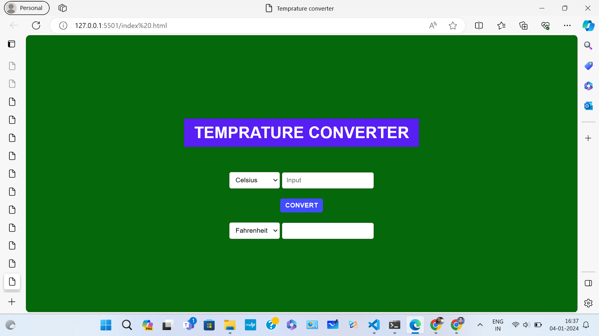

# Temperature Converter


![Webpage Mobile View}(temperature_converter_mobile_view.jpeg)

## Overview

This is a simple and responsive temperature converter website that allows users to convert temperatures between Celsius, Fahrenheit, and Kelvin. The website is designed with HTML, styled with CSS, and includes interactive features using JavaScript.

## Features

- Animated and responsive design.
- Converts temperatures between Celsius, Fahrenheit, and Kelvin.
- Easy-to-use interface with dropdowns and input fields.
- Conversion logic implemented in JavaScript.

## How to Use

1. Clone the repository to your local machine:

   ```bash
   git clone https://github.com/alex-00-pixel/temperature-converter-websilte.git
## License
This project is licensed under the MIT License.
